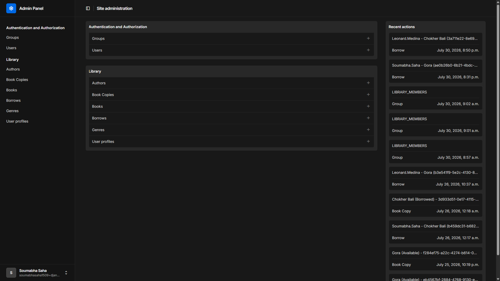
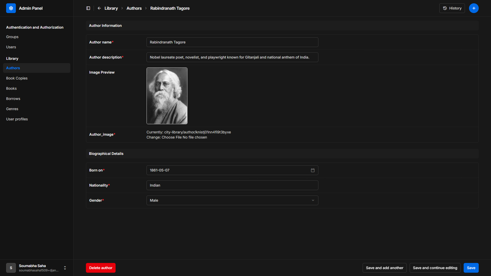
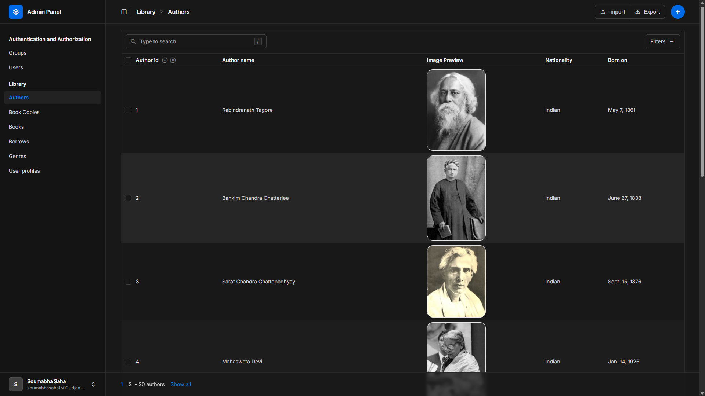
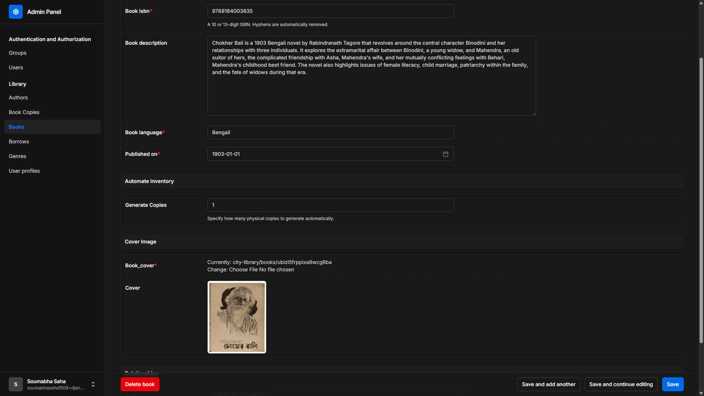
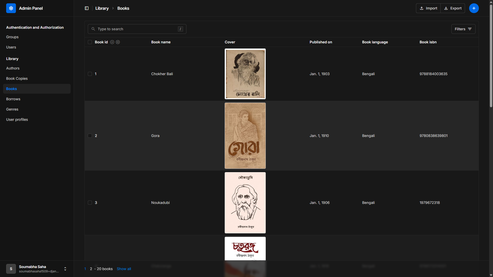
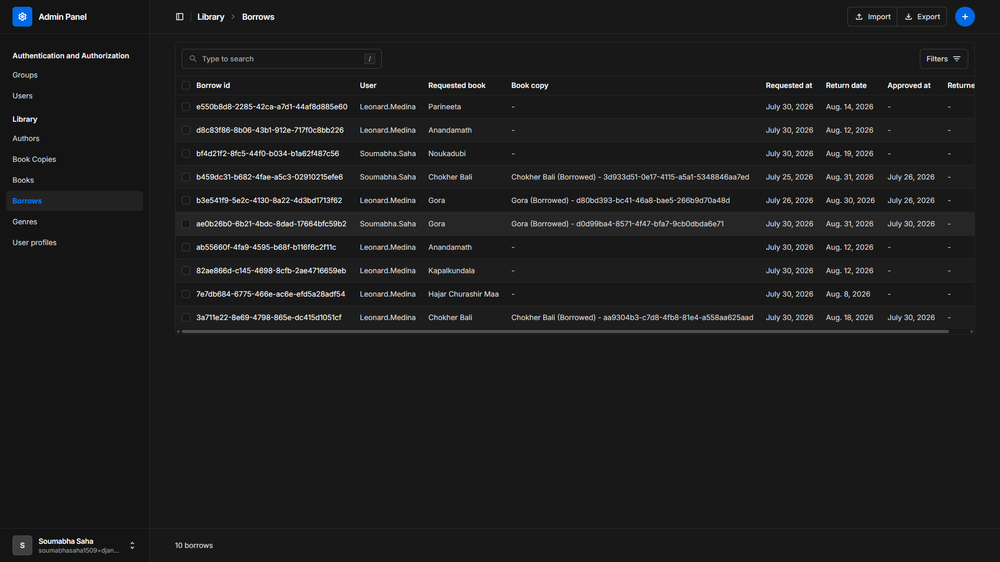
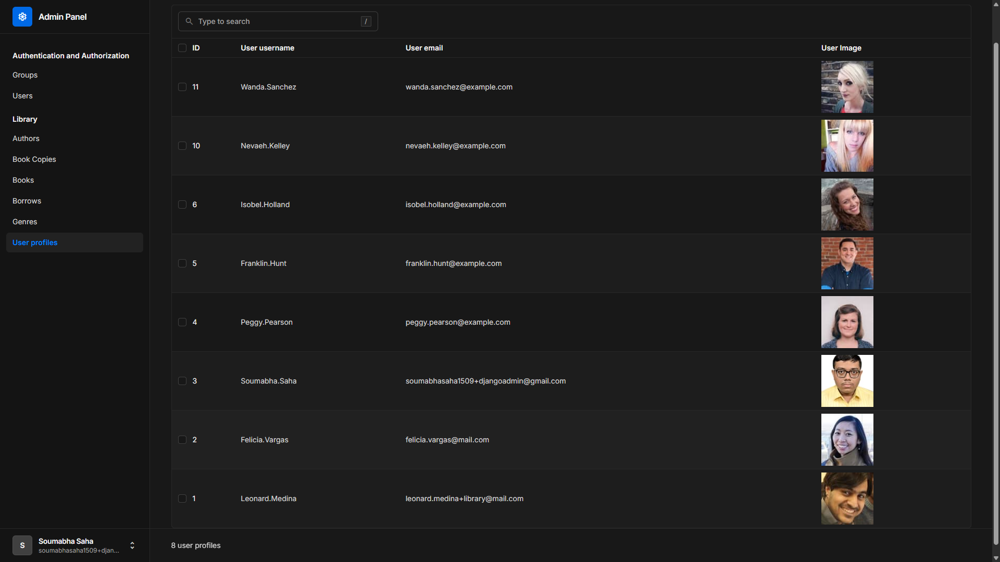

### ⚙️ Backend Ecosystem (Django)

|                                                                   Icon                                                                   | Link                                                           | Description                                                                     |
| :--------------------------------------------------------------------------------------------------------------------------------------: | :------------------------------------------------------------- | :------------------------------------------------------------------------------ |
|                        | [Django](https://www.djangoproject.com)                        | High-level Python web framework encouraging rapid development and clean design. |
|              | [Django REST Framework](https://www.django-rest-framework.org) | Powerful toolkit for building web APIs on top of Django.                        |
|                                               | [Django Unfold](https://unfoldadmin.com)                       | Modern, clean theme for the Django Admin interface built with Tailwind CSS.     |
|                                          | [SQLite](https://sqlite.org)                                   | Lightweight, serverless, self-contained SQL database engine.                    |
|  | [Cloudinary](https://cloudinary.com)                           | Cloud-based service for managing, optimizing, and delivering images and videos. |
|                                            | [uv](https://docs.astral.sh/uv)                                | Extremely fast Python package and project manager written in Rust.              |

### 📷 Previews

<!-- Admin Panel Overview -->
<details>
  <summary>View Admin Panel Overview</summary>
  
</details>

<!-- Author Details -->
<details>
  <summary>View Author Details</summary>
  
</details>

<!-- Author List -->
<details>
  <summary>View Author List</summary>
  
</details>

<!-- Book Details -->
<details>
  <summary>View Book Details</summary>
  
</details>

<!-- Book List -->
<details>
  <summary>View Book List</summary>
  
</details>

<!-- Borrow List -->
<details>
  <summary>View Borrow List</summary>
  
</details>

<!-- User Profile -->
<details>
  <summary>View User Profile</summary>
  
</details>

### ⭐ Useful commands for uv

```bash
  uv init DjangoAdmin
  uv sync --link-mode=copy
  uv add <pkg-name> --link-mode=copy
  cd DjangoAdmin
  uv run django-admin startproject Admin .
  uv run manage.py startapp library
  uv run manage.py createsuperuser
  uv run manage.py makemigrations
  uv run manage.py migrate
  uv run manage.py collectstatic --noinput
  uv run manage.py runserver
  uv run uvicorn Admin.asgi:application --host 127.0.0.1 --port 8000
```

### 📊 Useful graph_viz commands

```bash
  ./manage.py graph_models library --app-style graph_viz.json -o er-diagram.svg
  # for all apps
  ./manage.py graph_models -a --app-style graph_viz.json -o er-diagram.svg
```
