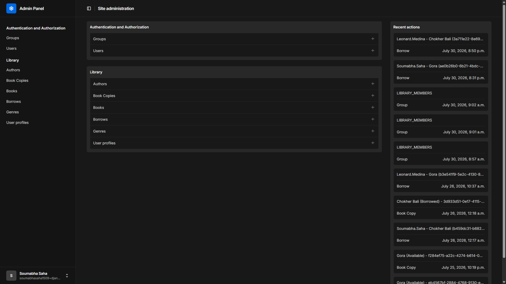
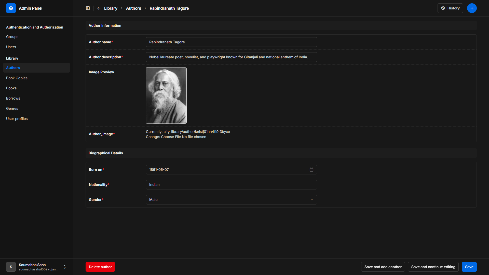
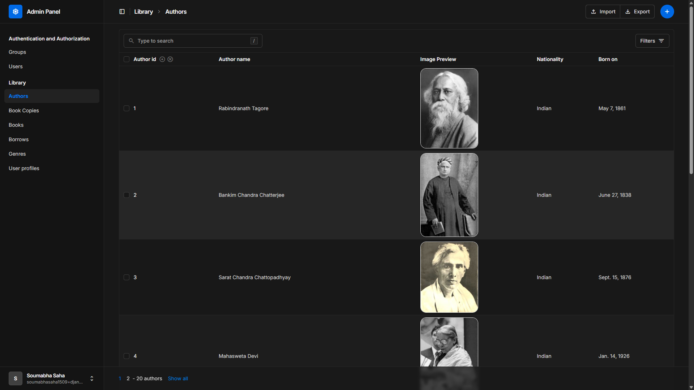
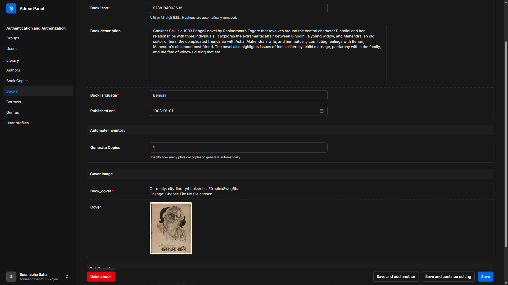
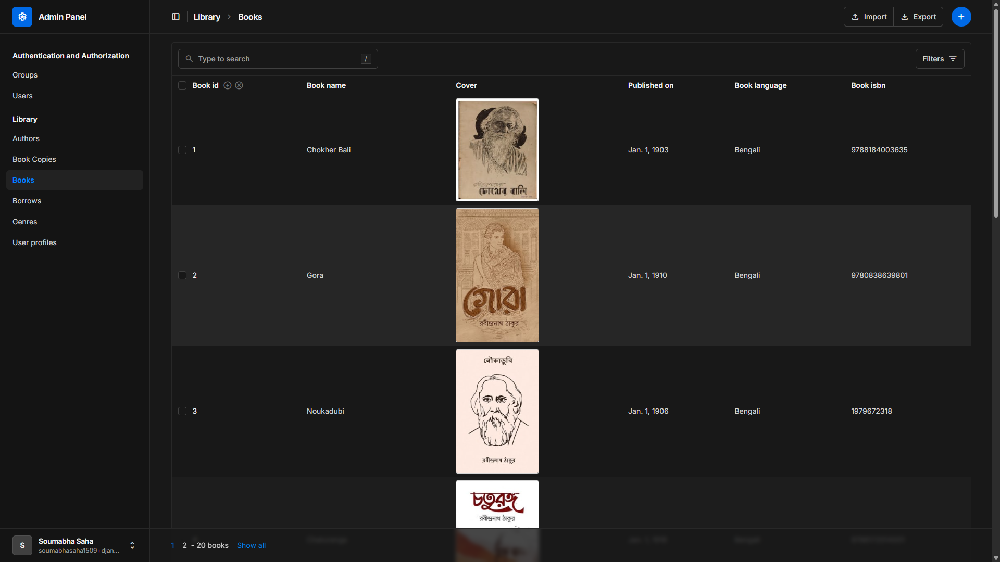
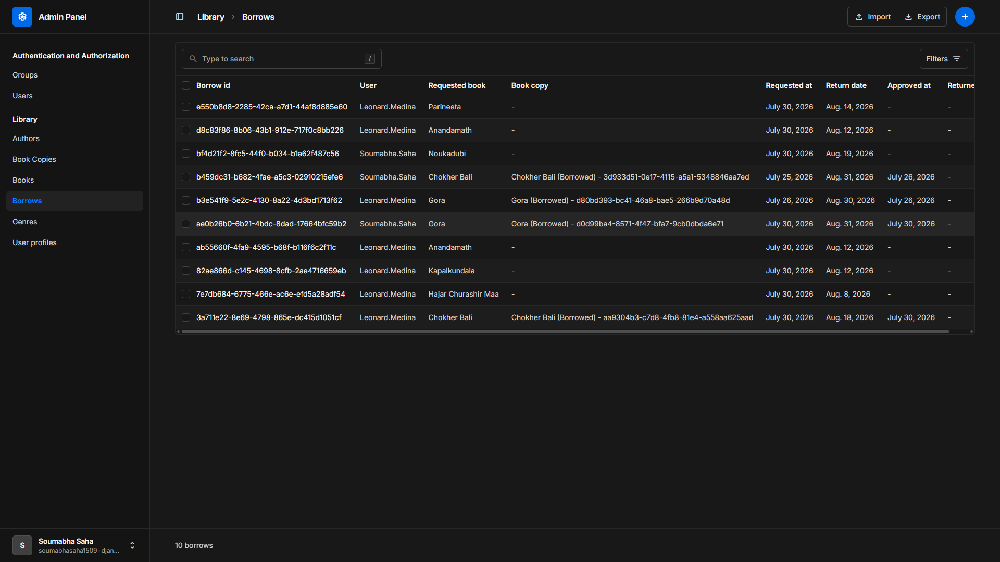
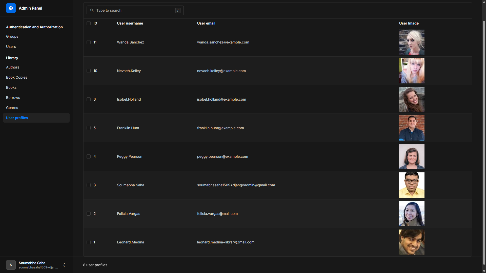

### 📷 Previews

<!-- Admin Panel Overview -->
<details>
  <summary>View Admin Panel Overview</summary>
  
</details>

<!-- Author Details -->
<details>
  <summary>View Author Details</summary>
  
</details>

<!-- Author List -->
<details>
  <summary>View Author List</summary>
  
</details>

<!-- Book Details -->
<details>
  <summary>View Book Details</summary>
  
</details>

<!-- Book List -->
<details>
  <summary>View Book List</summary>
  
</details>

<!-- Borrow List -->
<details>
  <summary>View Borrow List</summary>
  
</details>

<!-- User Profile -->
<details>
  <summary>View User Profile</summary>
  
</details>

### ⭐ Useful commands for uv

```bash
  uv init DjangoAdmin
  uv sync --link-mode=copy
  uv add <pkg-name> --link-mode=copy
  cd DjangoAdmin
  uv run django-admin startproject Admin .
  uv run manage.py startapp library
  uv run manage.py createsuperuser
  uv run manage.py makemigrations
  uv run manage.py migrate
  uv run manage.py collectstatic --noinput
  uv run manage.py runserver
  uv run uvicorn Admin.asgi:application --host 127.0.0.1 --port 8000
```

### 📊 Useful graph_viz commands

```bash
  ./manage.py graph_models library --app-style graph_viz.json -o er-diagram.svg
  # for all apps
  ./manage.py graph_models -a --app-style graph_viz.json -o er-diagram.svg
```
