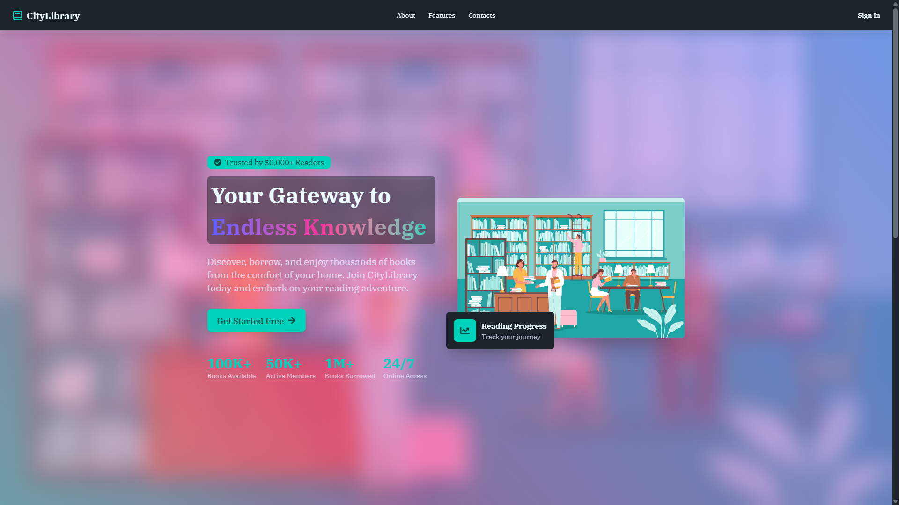
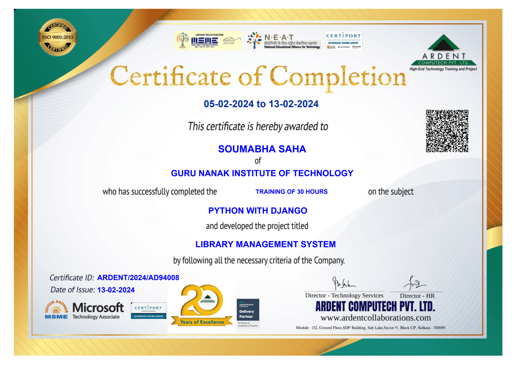
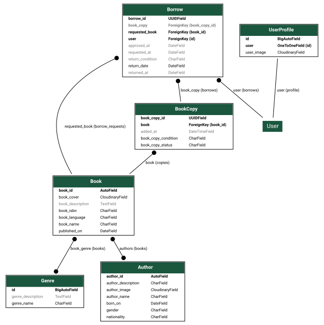

  
  
  # 📚 CityLibrary
  
  **A Sleek, Modern Digital Library Management System**
  
  

    <a href="#-overview">Overview</a> •
    <a href="#-core-features">Features</a> •
    <a href="./ViteServer">Frontend</a> •
    <a href="./DjangoAdmin/">Backend</a>
  

---

> ## Landing page

> ## Ardent online certification

> ## Database diagram

> 

### 🌟 Overview

**CityLibrary** is a high-performance, full-stack application designed to make digital cataloging, author indexing, and book borrowing an effortless and immersive experience.

Built with a headless architectural philosophy, the platform separates robust server-side business logic and validation from a lightning-fast, state-synchronized single-page frontend.

---

### 🚀 Core Features

- 📖 **Advanced Cataloging:** Filter books dynamically by specific ranges, sub-string matching, matching fields, and cross-relational metadata models.
- ✍️ **Comprehensive Author Indexing:** Clean, dedicated views showcasing author nationalities, profiles, and historical publications.
- 🎫 **Fluid Borrowing Workflows:** Seamless routing mechanics to manage rental forms without losing interface context.
- 🎨 **Adaptive Theming:** Zero-flash theme initialization supporting custom visual configurations out of the box.

---

  CityLibrary Architecture • Maintained by <a href="https://github.com/soumabhasaha15">soumabhasaha15</a>

