# previews

  
Authentication Views

  
  

    
Login Page

    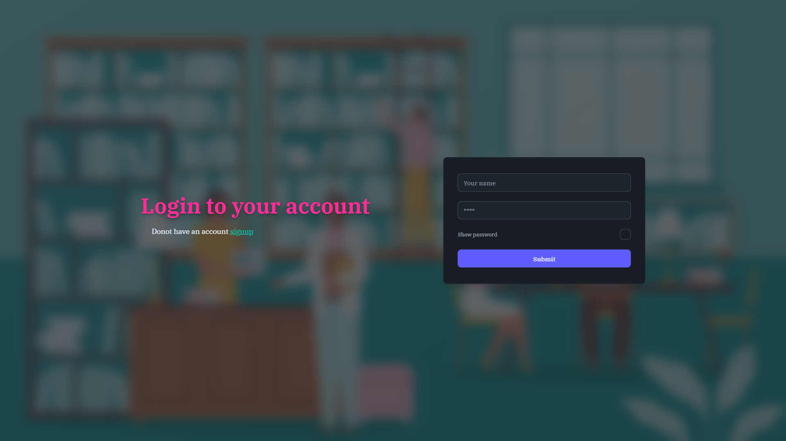
    
User authentication form allowing existing members and admins to log in with username and password credentials.

  

  

    
Sign Up Page

    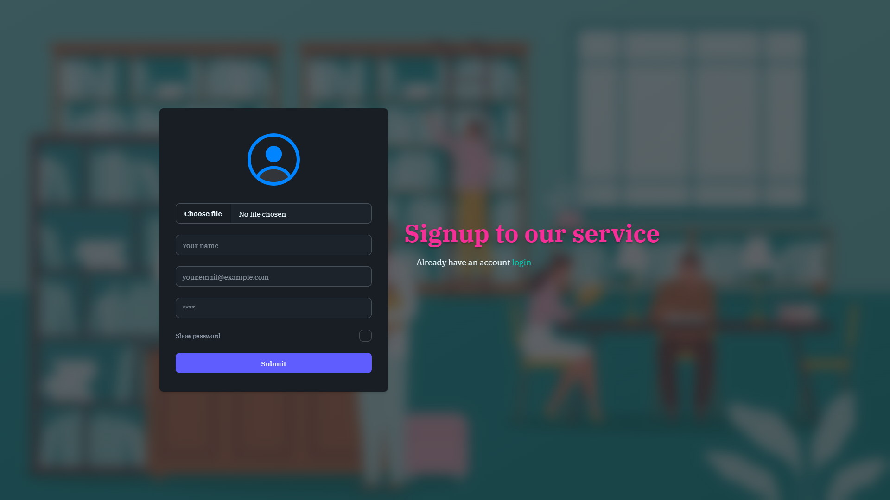
    
Registration form for new library members to create an account by filling out their personal details.

  

  
Navigation & Drawers

  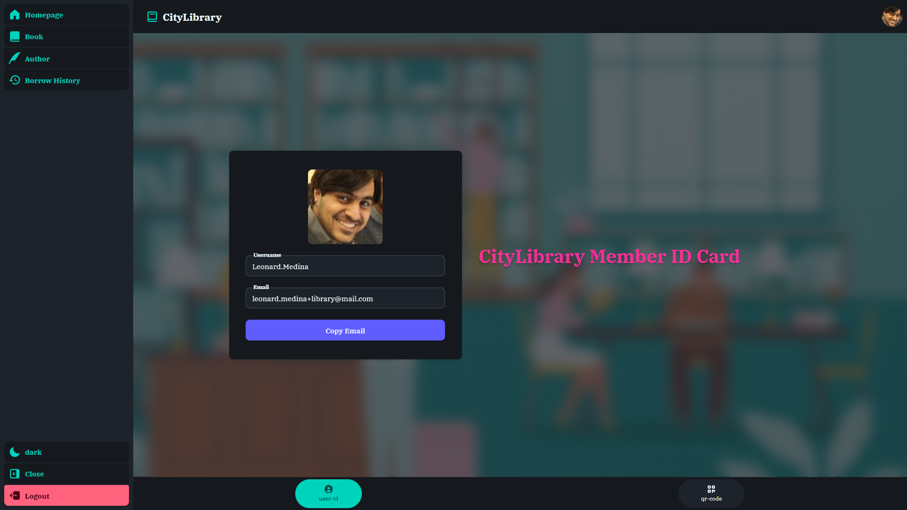
  
Expanded side navigation drawer displaying application links, user profile shortcuts, and system navigation options.

  
Book Views

  
  

    
Book List

    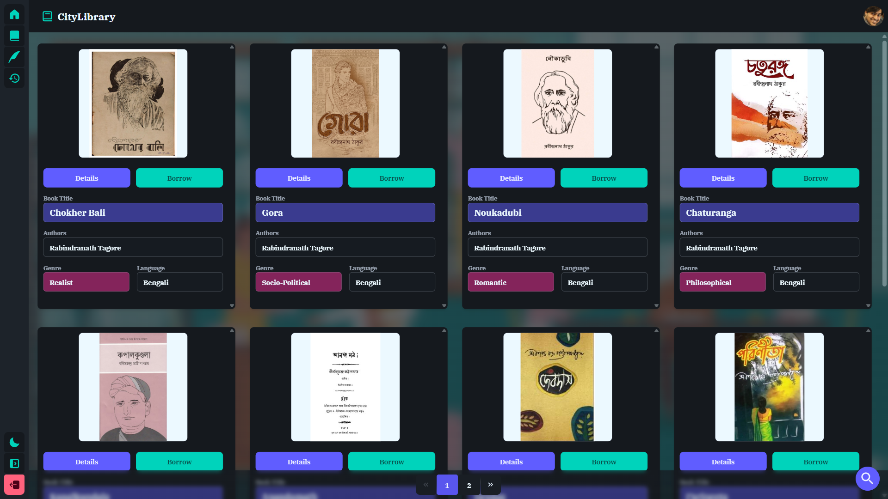
    
Paginated collection view displaying available library books, filtering parameters, and cover image thumbnails.

  

  

    
Book Details

    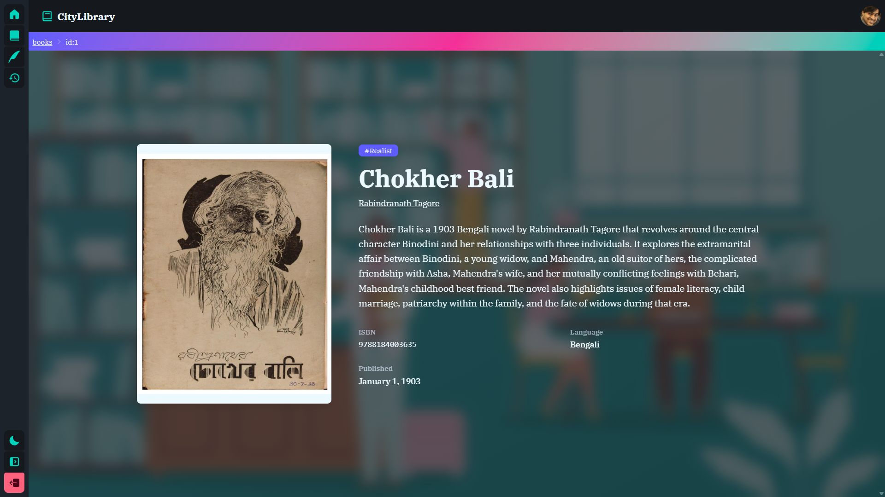
    
Detailed view for a selected book showing availability status, author information, descriptions, and borrow request triggers.

  

  
Author Views

  
  

    
Author List

    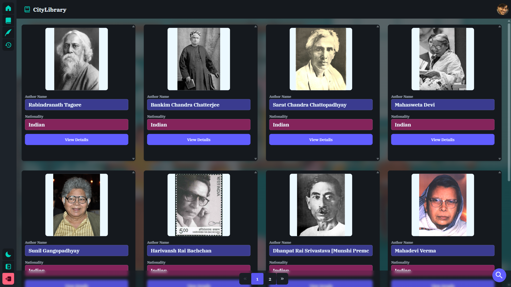
    
Directory listing of all registered authors with search controls and bibliography metrics.

  

  

    
Author Details

    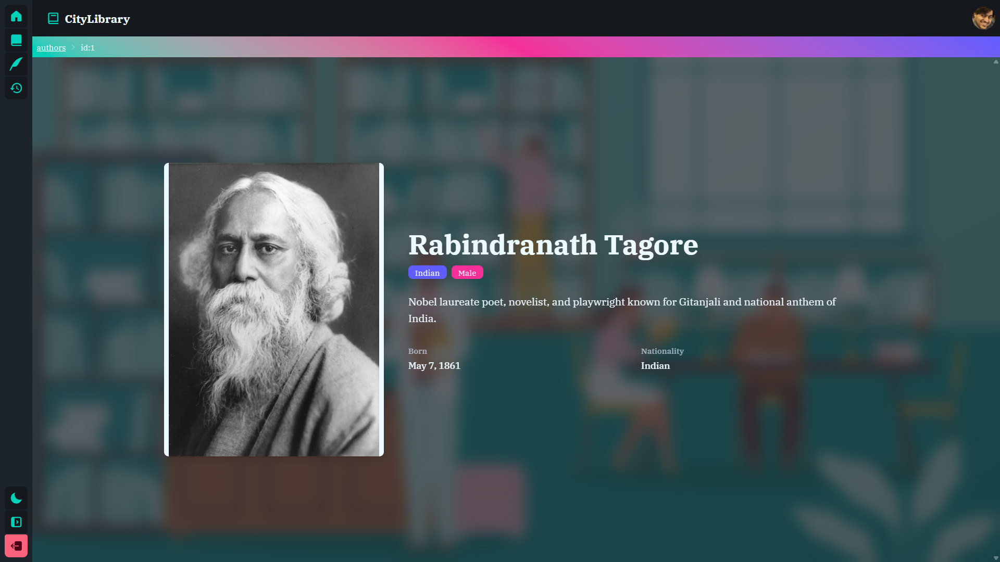
    
Author profile page highlighting biography details, associated published books, and catalog references.

  

  
Borrow Management

  
  

    
Borrow List

    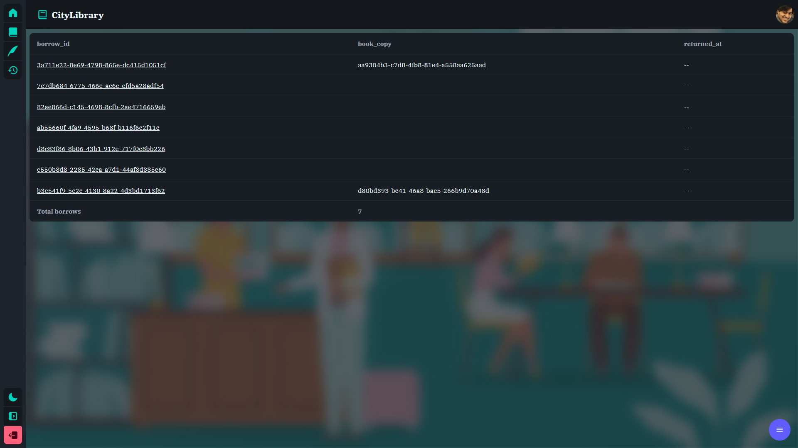
    
Paginated view listing active, past, and pending borrow requests belonging to the logged-in user.

  

  

    
Borrow Details

    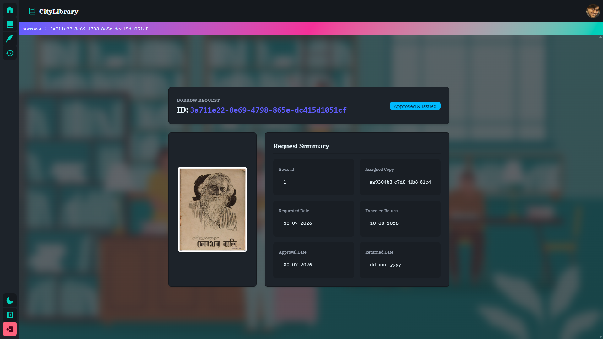
    
Detailed breakdown of a specific borrow record including UUID identification, issue dates, return deadlines, and assigned copy info.

  

  
User Profile Views

  
  

    
User Details (Text Format)

    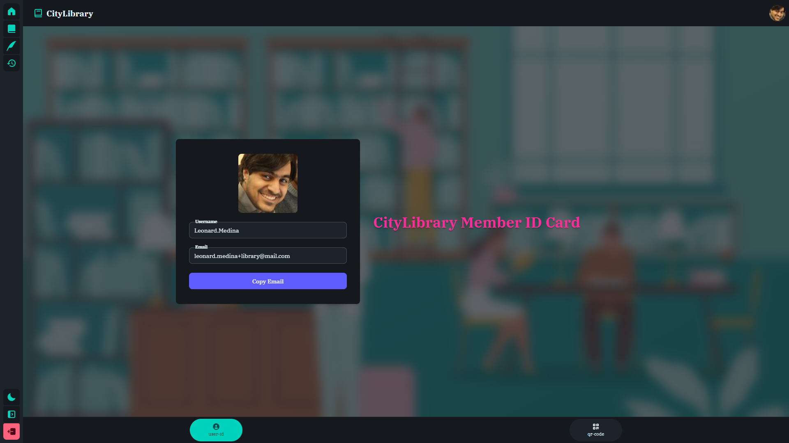
    
Standard text-based profile view showing account details, contact information, and membership group status.

  

  

    
User Details (QR Code Format)

    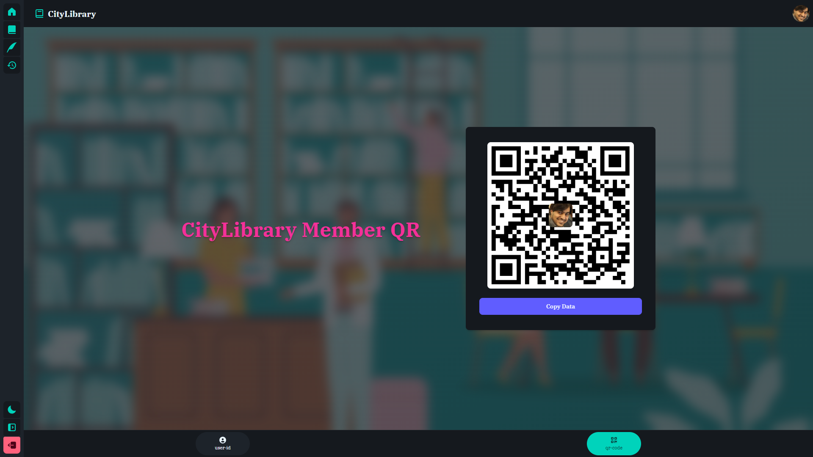
    
Digital member badge displaying a generated QR code for fast library check-ins and identification scanning.

  

### 🎨 Frontend Ecosystem (React)

|                                                         Icon                                                          | Link                                                      | Description                                                                                      |
| :-------------------------------------------------------------------------------------------------------------------: | :-------------------------------------------------------- | :----------------------------------------------------------------------------------------------- |
|                                   | [React](https://react.dev)                                | A JavaScript library for building user interfaces using component-based architecture.            |
|         | [Tailwind CSS](https://tailwindcss.com)                   | A utility-first CSS framework for rapidly building custom user interfaces.                       |
|  | [React Icons](https://react-icons.github.io/react-icons/) | Popular icon sets bundled into a single package using ES6 imports for React apps.                |
|                | [daisyUI](https://daisyui.com)                            | A configurable, class-based component library built on top of Tailwind CSS.                      |
|                          | [Zag.js](https://zagjs.com)                               | Framework-agnostic UI component logic powered by finite state machines.                          |
|                             | [TanStack](https://tanstack.com)                          | High-quality open-source web development libraries (Query, Router, Form, Store, devtools, etc.). |
|                                  | [Axios](https://axios-http.com)                           | Promise-based HTTP client for the browser and Node.js.                                           |
|                               | [Zod](https://zod.dev)                                    | TypeScript-first schema validation library with static type inference.                           |
|                               | [Vite](https://vite.dev)                                  | Next-generation frontend tooling providing fast dev server and optimized builds.                 |
